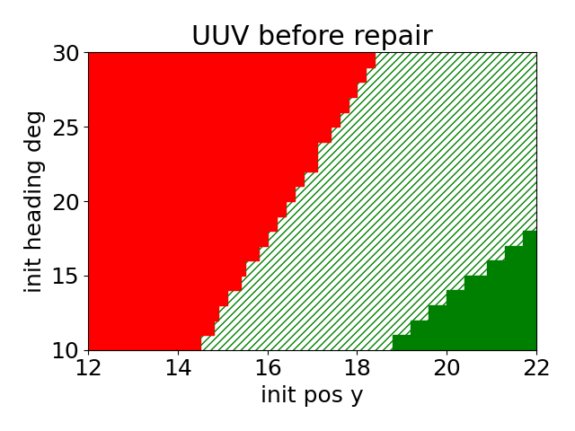

# Repeatability Package of Incremental Simulated Annealing Repair

### Step 0: Setup Docker container

This is the repeatability package for ICCPS 2024 Submission "Repairing Learning-Enabled Controllers While Preserving What Works".
Please note: the following instructions are for the Dockerized application. If Docker does not work, please visit our GitHub page [https://github.com/ericlupy/isar_rep]
and find the non-Dockerized version under the `no_docker` branch and follow the other instruction to set up the environment manually.

We wrap up the application as a Docker image. To start the Docker container, run
```
docker run -d --name isar_rep_env isar_rep
```
This will start the Docker container by installing the Python packages needed and Verisig. 
Please note that this requires a Linux OS, with `Ubuntu >= 16.04` recommended.

After the Docker container is started, it will wait for manual execution of our scripts as follows.

### Step 1: Generate iniitial state space partitions

First, we partition the initial state regions by calling

```
docker exec -it isar_rep_env python generate_partition.py --benchmark=<uuv|mc>
```

This will generate a partition of initial state space for UUV or MC. The partition is saved as a csv file, with each rectangular
region's lower bound and higher bound of every dimension.


### Step 2: Verify controller networks on initial state regions

Next, we call Verisig to verify the controller network on each of the partitioned regions. Verification on each region will be run in parallel.
Please notice that we have prepared a `.cfg` and `.xml` file for both UUV and MC. These files encode the system dynamics.
We also have a `...multi.yml` for both. This file encodes the STL specification.

The initial broken controller networks are in `/controllers`. Verisig requires `.yml` files for neural network controllers.

With Verisig installed and all files prepared, we call the following code for parallel verification on initial state regions.

```
docker exec -it isar_rep_env python verisig_call.py --benchmark=<uuv|mc> --network=<control network yaml file> --verisig_path=<directory where verisig is installed> --verisig_output_path=<directory to write verisig output txt files> --cpu_ratio=<percentage of cpus to be used, between 0 and 1> --initial_state_regions_path=<csv file of partitioned regions from previous step>
```

Warning: Running Verisig parallel verification may take a very long time (please expect more than 12 hours), depending on CPU utilization. Verification log of each initial state region will be recorded in a txt file in the specified output directory. This will take a large storage (please expect over 1GB).

After all regions are verified, we can parse the results by calling
```
docker exec -it isar_rep_env python verisig_parse_results.py --benchmark=<uuv|mc> --network=<control network yaml file> --verisig_output_path=<directory of verisig output txt files> --initial_state_regions_csv=<csv file of partitioned regions from previous step>
```
The verification of each region will be run in a subprocess, output to a txt log file.
The verification results of all initial state regions will be parsed from Verisig logs and written to another csv file.
Execution time of verifying each region will be recorded at the end of every txt log file.

### Step 3: Repair controller networks

**Please notice that due to randomness (from random sampling of initial states per region and random perturbation in simulated annealing), the output may not necessarily be the same as in our paper.**

After verification on the broken controller is done, we repair the controller by Incremental Simulated Annealing Repair (ISAR). 
First, we uniformly sample initial states from each region.
```
docker exec -it isar_rep_env python sample_states_in_regions.py --benchmark=<uuv|mc> --network=<control network yaml to be repaired> --initial_state_regions_path=<csv file of partitioned regions from previous step> --sampled_result_path=<ampling result csv to be written> --num_samples_per_region=<a positive int, by default 10>
```
This will sample a fixed number of initial states per region and obtain STL robustness of each sampled state. The result will be written in the specified sampled result path as a csv.

Next, with initial states sampled, we run the ISAR algorithm by calling
```
docker exec -it isar_rep_env python incremental_repair.py --benchmark=<uuv|mc> --network=<control network yaml to be repaired> --verisig_result_path=<verisig result csv> --sampled_result_path=<sampling result csv> --output_path=<directory to all output files>
```
This is the main repair algorithm. At every iteration, the network will be checkpointed as both yaml and PyTorch files if the selected region is repaired and no good sampled states are broken.
The new STL robustness on all sampled states will also be checkpointed as csv files.
Please expect that this will take a long time, around 1-2 days. Notice that the system dynamics informaion is encoded in `uuv_model_oneHz.mat`.
Since the repaired network and the new STL robustness will be checkpointed after every iteration, we can always early stop and use one of the checkpoints as the output.
Execution time of repairing each region will be displayed in the standard output.


### Step 4: Verify the repaired controller
The repaired network can be verified again using Verisig. It is the same operation as step 2, except that the input network yaml file into `verisig_call.py` is replaced by the repaired file.
Notice that we don't necessarily need to use the very last repaired network - any checkpointed network during the repair procedure can also be verified again and see the outcome.


### Step 5: Visualize results
Once we have a verification result and a sampled result (both as csv files) for a controller network, we can visualize the outcome as in our paper.
By calling
```
docker exec -it isar_rep_env python visualization.py --benchmark=<uuv|mc> --verisig_result_path=<verisig result csv> --sampled_result_path=<sampling result csv> 
```
It will end up with a plot like the follows.



Configurations of this plot, such as title, ticks and size can be modified in `visualization.py`.
This code will also output the number of the three types of regions,
and the mean and std of min STL robustness in red, non-red and overall regions (as in our Table 1 and 3).


